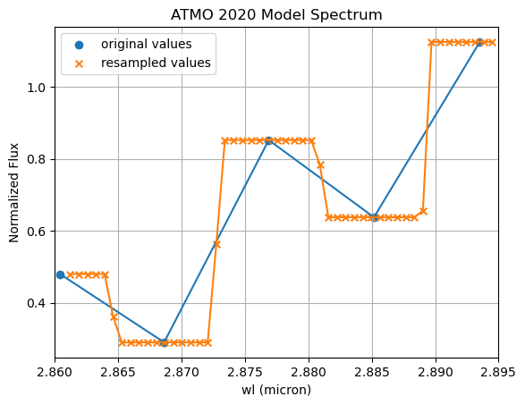

About SEDA
==========

Attribution
-----------
**The SEDA release paper is** `Suárez et al. (2026, in prep.) <https:xxx>`__, but the code was used in `Suárez et al. (2021) <https://ui.adsabs.harvard.edu/abs/2021ApJ...920...99S/abstract>`__. Please cite the release paper if :math:`\texttt{SEDA}` has contributed to your research. Also make sure to give credits to the models (see :ref:`models`) and other relevant python packages (e.g., see :ref:`seda_overview`) you use via :math:`\texttt{SEDA}`.

Contributing
------------
The :math:`\texttt{SEDA}` package is under active development. Help us improve :math:`\texttt{SEDA}` by reporting `issues <https://github.com/suarezgenaro/seda/issues>`__ on the GitHub repository.

Questions and feedback
----------------------
:math:`\texttt{SEDA}` was developed and is maintained by Genaro Suárez (gsuarez@amnh.org, gsuarez2405@gmail.com). Please reach out with any suggestions, questions, and/or feedback.

Logo
----
Seda is a Spanish word meaning *silk*, which motivates the `SEDA logo <https://github.com/suarezgenaro/seda/blob/main/docs/_static/SEDA_logo.png>`_.

The logo shows a silk cocoon, symbolizing the irregular parameter grids that the code can handle, wrapping key molecules—water, methane, ammonia, and silicates—that are common in the atmospheres of brown dwarfs and gas-giant (exo)planets, which are represented in the background image.

FAQs
----

.. contents::
   :local:
   :depth: 1

How can users customize output plots?
~~~~~~~~~~~~~~~~~~~~~~~~~~~~~~~~~~~~~

Plotting functions, such as those in the modules ``plots`` and
``spectral_indices.spectral_indices``, return the Matplotlib objects
``fig`` and ``ax`` (or ``axs`` for multiple subplots). This design allows
users to customize the resulting figures using standard Matplotlib
commands, for example to modify axis labels, font sizes, grids, legends,
or titles.

Below is an example showing how to customize a plot produced by
``plot_synthetic_photometry`` using the output by ``synthetic_photometry``, as explained in 
`this tutorial <https://seda.readthedocs.io/en/latest/notebooks/tutorial_synthetic_photometry.html>`__:

.. code-block:: python

   import matplotlib.pyplot as plt

   # Generate plot for synthetic photometry
   fig, axs = seda.plots.plot_synthetic_photometry(output_synthetic_photometry)

   # Improve legend
   axs[0].legend(
       prop={'size': 10.0},
       handlelength=1,
       handletextpad=0.5,
       labelspacing=0.5
   )

   # Set plot title
   axs[0].set_title('Synthetic photometry', fontsize=15)

   # Increase font size of axis labels
   axs[0].yaxis.label.set_size(15)
   axs[1].yaxis.label.set_size(15)
   axs[1].xaxis.label.set_size(15)

   # Export plot as PDF
   plt.savefig('synthetic_photometry.pdf', bbox_inches='tight')
   plt.show()

Because the returned objects are standard Matplotlib figures and axes,
any Matplotlib customization supported by ``fig`` and ``ax`` can be
applied in the same way as for user-generated plots.  

SEDA is not recognized in my Jupyter notebook
~~~~~~~~~~~~~~~~~~~~~~~~~~~~~~~~~~~~~~~~~~~~~

SEDA was installed using ``pip install -e .`` but it is not recognized in my Jupyter notebook. 

This usually means that SEDA was installed with a **different Python interpreter** than the one used by Jupyter. This issue occurs most frequently on **Windows**, particularly when working with **Anaconda** or multiple Python installations.

To resolve this, ensure that SEDA is installed using the **exact Python executable that Jupyter is running**.

Step 1: Find the Python executable used by Jupyter
^^^^^^^^^^^^^^^^^^^^^^^^^^^^^^^^^^^^^^^^^^^^^^^^^^

Run the following command in a Jupyter notebook cell:

.. code-block:: python

   import sys
   sys.executable

Example output:

.. code-block:: console

   C:\Users\YourName\anaconda3\python.exe

Step 2: Install SEDA using that Python executable
^^^^^^^^^^^^^^^^^^^^^^^^^^^^^^^^^^^^^^^^^^^^^^^^^

From a terminal (Command Prompt or PowerShell), navigate to the cloned ``seda`` repository and run:

.. code-block:: bash

   "C:\Users\YourName\anaconda3\python.exe" -m pip install -e .

Replace the path with the one returned in Step 1.

PowerShell note
^^^^^^^^^^^^^^^
In PowerShell, prefix the command with ``&`` to correctly execute a quoted path:

.. code-block:: bash

   & "C:\Users\YourName\anaconda3\python.exe" -m pip install -e .

This ensures that the editable installation is performed in the same environment used by Jupyter, making SEDA available within your notebooks.

Why do the residuals from the best fit to photometric data points not scatter around zero?
~~~~~~~~~~~~~~~~~~~~~~~~~~~~~~~~~~~~~~~~~~~~~~~~~~~~~~~~~~~~~~~~~~~~~~~~~~~~~~~~~~~~~~~~~~

This behavior can occur when one photometric magnitude has a **significantly smaller uncertainty** than the others. In such cases, the fit becomes dominated by this single data point, forcing the best-fit model to closely match it—even if the remaining data points lie systematically above or below the model.

To obtain residuals that scatter more symmetrically around zero, identify magnitudes with unusually small uncertainties and consider either inflating the uncertainties or excluding these data points from the fit.

How should I interpret the output parameters from Dynesty?
~~~~~~~~~~~~~~~~~~~~~~~~~~~~~~~~~~~~~~~~~~~~~~~~~~~~~~~~~~

A detailed explanation of each output parameter from Dynesety stored in ``out_bayes['out_dynesty']`` can be found in the official `Dynesty Results documentation <https://dynesty.readthedocs.io/en/stable/api.html#dynesty.results.Results>`__.

Model spectra in the plots appear binned
~~~~~~~~~~~~~~~~~~~~~~~~~~~~~~~~~~~~~~~~

This effect may be caused by resampling model spectra to **finer wavelength intervals** than those of the original models.

In such cases, the ``spectres`` package used for resampling returns:

- Flux values equal to the nearest original values closest in wavelength (when the number of new wavelengths within two original wavelengths is even) or these values together with the mean flux of two consecutive original wavelengths (when the number of new wavelengths within two original wavelengths is odd).

This behavior produces a **histogram-like appearance** in the resampled spectra.

It has been observed only for the **low-resolution ATMO 2020 models** when fitting spectra of similar resolution obtained by convolving higher-resolution spectra while retaining finer wavelength sampling.

There is a flux offset between the best-fit model and the input data
~~~~~~~~~~~~~~~~~~~~~~~~~~~~~~~~~~~~~~~~~~~~~~~~~~~~~~~~~~~~~~~~~~~~

This issue may arise from:

- Incorrect input flux units specified via ``flux_unit`` in ``seda.input_parameters.InputData``
- Flux calibration issues in the input spectra

How to diagnose the issue
^^^^^^^^^^^^^^^^^^^^^^^^^
Run a chi-square minimization (e.g., look at `this tutorial <https://seda.readthedocs.io/en/latest/notebooks/tutorial_chi2_fit_single_spectrum.html>`__) while providing a distance in ``seda.input_parameters.InputData``. In this case, the code estimates a radius from the scaling factor applied to the model spectra and the input distance. If the estimated radius (stored in the ASCII output table) deviates significantly from **1 Rjup**, this may indicate incorrect flux units or calibration issues.

Additional checks
^^^^^^^^^^^^^^^^^
- Compare observed photometry with synthetic photometry derived from the input spectra  
  (see `this tutorial <https://seda.readthedocs.io/en/latest/notebooks/tutorial_synthetic_photometry.html>`__)
- Run ``seda.bayes_fit.bayes`` **without providing a distance**, so the radius is not sampled and the
  models are scaled to minimize chi-square residuals, compensating for potential flux issues

Error opening generated pickle files
~~~~~~~~~~~~~~~~~~~~~~~~~~~~~~~~~~~~

The error ``ModuleNotFoundError: No module named 'numpy._core'`` typically indicates a **problem with the NumPy installation**, such as a corrupted installation or a mismatch between NumPy versions used to create and load the pickle files.

Possible solutions
^^^^^^^^^^^^^^^^^^

Reinstall NumPy:

.. code-block:: bash

   pip uninstall numpy
   pip install numpy

Upgrade NumPy:

.. code-block:: bash

   pip install --upgrade numpy

Verify the installation:

.. code-block:: python

   import numpy
   print(numpy.__version__)

After cloning SEDA, my notebook still uses the old version
~~~~~~~~~~~~~~~~~~~~~~~~~~~~~~~~~~~~~~~~~~~~~~~~~~~~~~~~~~

After cloning the repository, reinstall the package by following the `installation instructions <https://seda.readthedocs.io/en/latest/installation.html>`__.

Then:

1. Restart the notebook
2. Ensure it is running in the correct SEDA environment
3. Verify the installed version:

.. code-block:: python

   import seda
   print(seda.__version__)

Confirm that the reported version matches the `latest release <https://github.com/suarezgenaro/seda/releases>`__.

Is there a way to run the code faster, especially the convolution of model spectra?
~~~~~~~~~~~~~~~~~~~~~~~~~~~~~~~~~~~~~~~~~~~~~~~~~~~~~~~~~~~~~~~~~~~~~~~~~~~~~~~~~~~

The convolution of high-resolution model spectra is the **most computationally expensive** component of the workflow.

Performance optimization strategies
^^^^^^^^^^^^^^^^^^^^^^^^^^^^^^^^^^^
- Constrain the parameter ranges to convolve only a relevant subset of the model grid  (see :meth:`~seda.input_parameters.ModelOptions`)
- Save convolved model spectra and reuse them to avoid repeating the convolution step

This approach is discussed in `GitHub issue #14 <https://github.com/suarezgenaro/seda/issues/14>`__ and can significantly speed up subsequent analyses.
