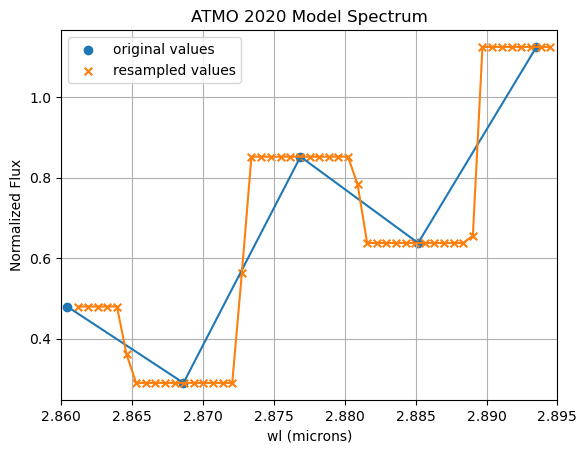

About SEDA
==========

Attribution
-----------
**The SEDA release paper is** `Suárez et al. (2024, in prep.) <https:xxx>`__, but the code was used in `Suárez et al. (2021) <https://ui.adsabs.harvard.edu/abs/2021ApJ...920...99S/abstract>`__. Please cite the release paper if :math:`\texttt{SEDA}` has contributed to your research. Also make sure to give credits to the models (see :ref:`models`) and other relevant python packages (e.g., see :ref:`seda_overview`) you use via :math:`\texttt{SEDA}`.

Contributing
------------
The :math:`\texttt{SEDA}` package is under active development. Help us improve :math:`\texttt{SEDA}` by reporting `issues <https://github.com/suarezgenaro/seda/issues>`__ on the GitHub repository.

Questions and feedback
----------------------
:math:`\texttt{SEDA}` was developed and is maintained by Genaro Suárez (gsuarez@amnh.org, gsuarez2405@gmail.com). Please reach out with any suggestions, questions, and/or feedback.

Logo
----
Seda is a Spanish word that means silk, which motivates the :math:`\texttt{SEDA}` logo. The logo shows a silk cocoon (irregular grid the code can handle) wrapping key molecules (water, methane, ammonia, and silicates) in the atmospheres of brown dwarfs and gas giant (exo)planets (background image).

FAQs
----
.. **4. T**

**7. Why do the residuals from the best fit to photometric data points not scatter around zero, but instead lie preferentially above or below it?**

This may happen when one photometric magnitude has a significantly smaller uncertainty compared to the others. In such cases, the fit is dominated by this data point, forcing the best-fit model to match it, even if the remaining points lie systematically brighter or fainter than the model. To obtain residuals that scatter more symmetrically around zero, identify any magnitude with unusually small errors and consider either inflating its uncertainty or excluding it from the fit.

**6. How to interpret the output parameters from Dynesty in ``out_bayes['out_dynesty']``.**

Look at `this Dynesty documentation <https://dynesty.readthedocs.io/en/stable/api.html#dynesty.results.Results>`__ explaining each output parameter.

**5. Model spectra in the plots appear binned.**

It may be caused by the resampling of model spectra to finer wavelength intervals than the original ones. In this case, the ``spectres`` package used for resampling returns either only flux values equal to the original values closest in wavelength (when the number of new wavelengths within two original wavelengths is even) or these values along with the mean flux of two consecutive original wavelengths (when the number of new wavelengths within two original wavelengths is odd). This leads to a 'histogram-like' appearance in the plot of the resampled fluxes (see plot below). This effect has been observed only for the low-resolution ATMO 2020 models when inputting a similar-resolution spectrum obtained by convolving a higher-resolution spectrum and keeping the same finer wavelength intervals.

**4. Flux offset between best model fit and input data in the plot produced by ``plot_bayes_fit``.**

It could be due to wrong input flux units given by ``flux_unit`` in ``seda.InputData`` or flux calibration issues in the input spectra. You could verify this by running the chi-square minimization (e.g. look at `this tutorial <https://seda.readthedocs.io/en/latest/notebooks/tutorial_chi2_fit_single_spectrum.html>`__) and providing a distance in ``seda.InputData`` so the code will estimate a radius from the scaling factor applied to the model spectra and the input distance. If the radius estimate (stored in the ascii table created when running the minimization) is too different from 1 Rjup, that may be an indication that the input spectra flux units or/and flux calibration are wrong. To inspect this potential flux issue, you could compare any available photometry in the wavelength coverage by the input spectra to synthetic photometry from the input spectra (to derive synthetic photometry look at `this tutorial <https://seda.readthedocs.io/en/latest/notebooks/tutorial_synthetic_photometry.html>`__). You could also run the nested sampling (``seda.bayes_fit``) without an input distance in ``seda.InputData`` so radius will not be sampled and the models will be scaled according to a factor that minimizes their chi-square residuals, which will compansate any issues with the input fluxes.

**3. Error opening the generated pickle files: ModuleNotFoundError: No module named 'numpy._core' when openning pickle file.**

It typically indicates an issue with the installation of the numpy package. Potential solutions are:

- Reinstall Numpy:

.. code-block:: console

    $ pip uninstall numpy
    $ pip install numpy

- Update Packages: Make sure all your packages are up to date. You can update numpy and other dependencies by running:

.. code-block:: console

    $ pip install --upgrade numpy

- Verify Installation: Sometimes, the installation might be corrupted. Verify that numpy is correctly installed by running:

.. code-block:: console

    $ import numpy
    $ print(numpy.__version__)

**2. Why after cloning SEDA to get an updated version my notebook still reads the old version?**

After cloning the repository, install the code (follow the installation steps `here <https://seda.readthedocs.io/en/latest/installation.html>`__). Then restart your notebook and make sure it was opened on the seda environment. Verify the code version printed when importing SEDA or by typing ``seda.__version__`` in your notebook matches the `latest version of the repository <https://github.com/suarezgenaro/seda/releases>`__.

**1. Is there a way to run the code faster, specially the convolution of model spectra?**

The convolution of high-resolution model spectra indeed takes up most of the runtime. You can constrain the ranges of the parameters in the models to convolve only a grid subset with relevant model spectra for your target (see :meth:`~seda.input_parameters.ModelOptions`). As suggested in this `issue <https://github.com/suarezgenaro/seda/issues/14>`__, you can save the convolved model spectra to reuse them and avoid the convolution step to expedite the forward modeling of additional data with a similar resolution.
