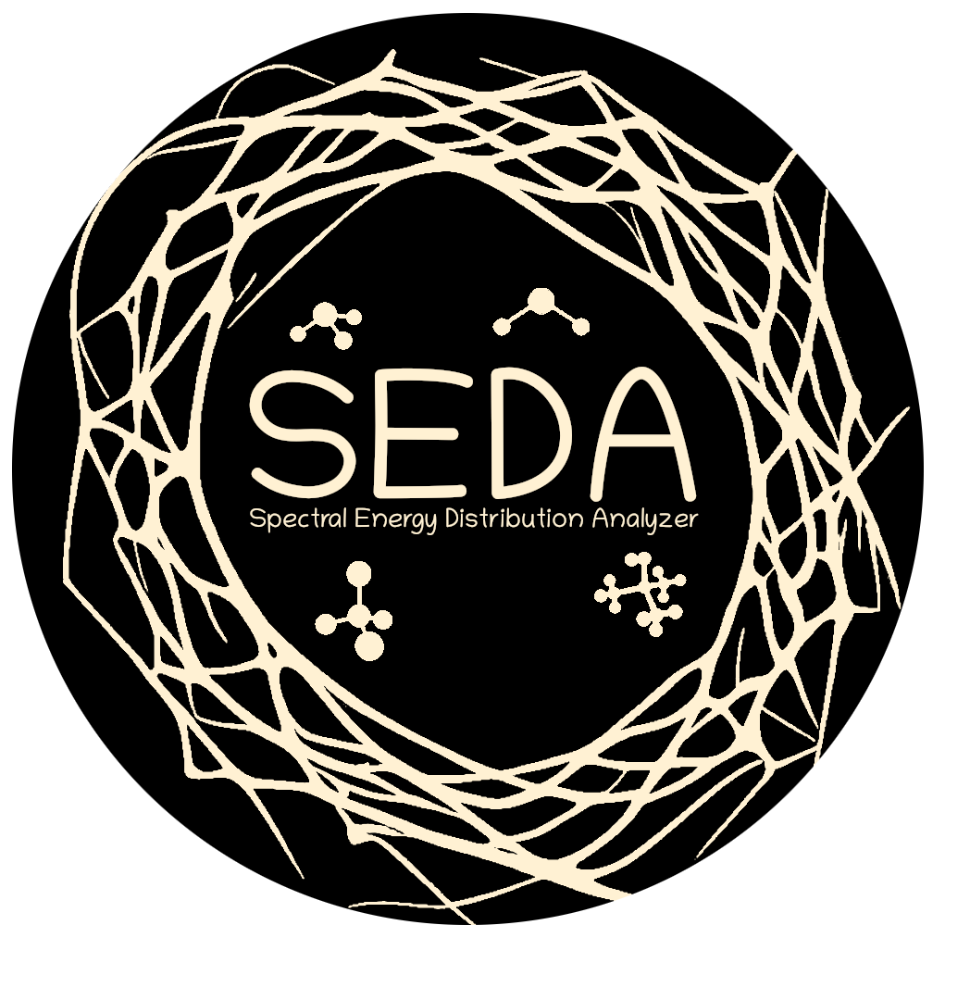

.. raw:: html

    

SEDA: Spectral Energy Distribution Analyzer
===========================================

:math:`\texttt{SEDA}` is an open-source Python package for forward modeling and empirical analyses of spectral energy distributions for ultracool objects, including brown dwarfs, directly imaged exoplanets, and low-mass stars. The code compares observed spectrophotometric data to atmospheric models by using a Bayesian framework to sample posteriors. Alternatively, the code minimizes the chi-square statistic to find the best model fits. SEDA also includes several tools useful for the analysis of spectral energy distributions and a variety of functions to visualize results.

Check out the content below for further information on how to install and use :math:`\texttt{SEDA}`.

.. toctree::
   :maxdepth: 2
   :caption: Contents

   Installation <installation.rst>
   Overview <overview.rst>
   Tutorials <tutorials.rst>
   Github <https://github.com/suarezgenaro/seda>
   API <api.rst>
   About SEDA <about_seda.rst>
