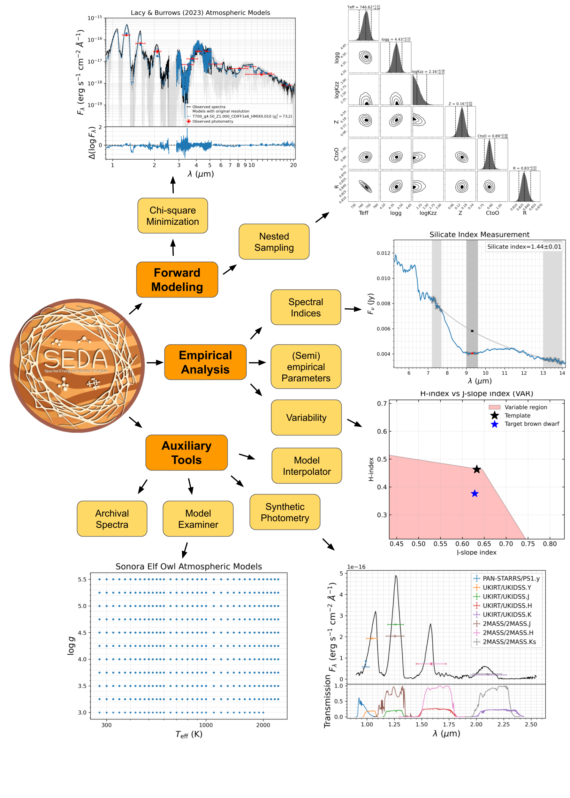

<!-- TEMPORARY author block for local PDF preview ONLY -->
<!-- Safe to remove before JOSS submission -->

Genaro Suárez$^{1}$, Kelle Cruz$^{1,2,3}$, Jacqueline K. Faherty$^{1}$, Rocio Kiman$^{4}$, Stanimir Metchev$^{5}$, Natalia Oliveros-Gomez$^{6}$, 
Michael K. Plummer$^{7}$, Johanna M. Vos$^{8}$, Daniella C. Bardalez Gagliuffi$^{9}$, Elena Manjavacas$^{10}$, Melanie J. Rowland$^{1}$, Samuel Candero$^{11,1}$, Jonathan Gagné$^{12,13}$, 
Thomas P. Bickle$^{14}$, Austin Rothermich$^{1,3}$, Madeline Lam$^{8}$, Easton J. Honaker$^{15}$, Sherelyn Alejandro Merchan$^{1,3}$, Niall Whiteford$^1$, Caprice L. Phillips$^{16}$, Sam Barber$^{5}$, 
Savaria Parrish$^{17}$, Jolie L'Heureux$^{1,3}$, Azul Ruiz Diaz$^{18,19}$

$^{1}$ Department of Astrophysics, American Museum of Natural History, New York, NY, USA  
$^{2}$ Department of Physics and Astronomy, Hunter College, City University of New York, NY, USA  
$^{3}$ Department of Physics, Graduate Center, City University of New York, 365 5th Ave., New York, NY 10016, USA  
$^{4}$ Department of Astronomy, California Institute of Technology, Pasadena, CA, USA  
$^{5}$ Department of Physics and Astronomy, Institute for Earth and Space Exploration, The University of Western Ontario, 1151 Richmond St, London, ON N6A 3K7, Canada  
$^{6}$ Department of Physics and Astronomy, Johns Hopkins University, Baltimore, MD 21218, USA  
$^{7}$ Department of Physics and Meteorology, United States Air Force Academy, 2354 Fairchild Drive, CO 80840, USA  
$^{8}$ School of Physics, Trinity College Dublin, The University of Dublin, Dublin 2, Ireland  
$^{9}$ Department of Physics & Astronomy, Amherst College, Amherst, MA, USA  
$^{10}$ AURA for the European Space Agency (ESA), ESA Office, Space Telescope Science Institute, 3700 San Martin Drive, Baltimore, MD 21218, USA  
$^{11}$ Department of Physics, Florida Atlantic University, 777 Glades Rd, Boca Raton, FL 33431, USA  
$^{12}$ Planétarium de Montréal, Espace pour la Vie, 4801 Avenue Pierre-de Coubertin, Montréal, Québec, Canada  
$^{13}$ Trottier Institute for Research on Exoplanets, Université de Montréal, Département de Physique, C.P. 6128 Succ. Centre-ville, Montréal, QC H3C 3J7, Canada  
$^{14}$ School of Physical Sciences, The Open University, Milton Keynes, MK7 6AA, UK  
$^{15}$ Department of Physics and Astronomy, University of Delaware, Newark, DE 19716, USA  
$^{16}$ Department of Astronomy & Astrophysics, University of California, Santa Cruz, CA 95064, USA  
$^{17}$ Department of Geosciences, Virginia Tech, Blacksburg, VA 24061, USA
$^{18}$ Planétarium Rio Tinto Alcan, Espace pour la Vie, 4801 av. Pierre-de Coubertin, Montréal, Québec, Canada  
$^{19}$ Institute for Research on Exoplanets, Université de Montréal, Département de Physique, C.P. 6128 Succ. Centre-ville, Montréal, QC H3C 3J7, Canada  

---

# Summary
<!-- 
\textit{A 2-4 paragraph summary explaining the purpose of your software. What problem does it solve? Who is it for? Why does it matter?}
-->

Brown dwarfs and extrasolar gas giant planets exhibit complex, dynamic atmospheres that undergo diverse physical and chemical processes, including disequilibrium chemistry, cloud formation, and variability, which depend on fundamental properties such as temperature, age, and metallicity [e.g., @Marley_Robinson2015]. 
These atmospheres also exhibit a rich diversity of chemical species, including water, methane, ammonia, carbon monoxide, carbon dioxide, and silicates [e.g., @Kirkpatrick2005;@Cushing_etal2006]. 
Studying the chemistry and physics of these atmospheres provides insights not only into the atmospheric processes that govern their behavior, but also into the formation and evolution of these objects.
In the long term, understanding these atmospheric conditions is essential for characterizing potential habitable worlds with next-generation observatories and for contextualizing the uniqueness of our own.

<!-- 
A synergy between observations and atmospheric models is crucial for understanding planetary and substellar atmospheres. 
While models enable the interpretation of the phenomena shaping the data, observations provide direct insights into the underlying physics and chemistry, allowing model improvements.
The overall performance of atmospheric models can be assessed by comparing them to observed spectral energy distributions (SEDs) [e.g., @Petrus_etal2024].
-->

We introduce `SEDA` (Spectral Energy Distribution Analyzer), a versatile open-source Python package for forward modeling of observations of ultracool objects, such as brown dwarfs, directly imaged exoplanets, and low-mass stars. 
This workflow employs a Bayesian framework based on pre-computed, self-consistent atmospheric models.
`SEDA` also incorporates a broad set of empirical techniques and auxiliary tools for spectral energy distribution (SED) analysis, as described in [Functionality](#functionality).
Overall, `SEDA` enables the inference and analysis of atmospheric composition, cloud properties, and fundamental physical parameters of ultracool objects from observational data.

# Statement of Need
<!-- 
\textit{Why this software is needed in the research community. What gap does it fill? What alternatives exist and how is yours different?}
-->

The James Webb Space Telescope (JWST) is revolutionizing our understanding of extrasolar atmospheres by providing high-quality observations of exoplanets and brown dwarfs. 
These data will synergize with observations from next-generation facilities such as the Nancy Grace Roman Space Telescope, the Habitable Worlds Observatory, the Vera C. Rubin Observatory, and 30-m class telescopes. 
Furthermore, a large volume of multiwavelength data is already available from wide-field photometric surveys [e.g., SDSS, @York_etal2000; and Pan-STARRS, @Chambers_etal2016], all-sky photometric surveys [e.g., Gaia, @GaiaCollaboration2020; 2MASS, @Skrutskie_etal2006; and WISE, @Cutri_etal2013], targeted spectroscopic programs [e.g., SpeX Prism Library, @Burgasser2014; MOCAdb, @Gagne_etal2025], and both large [e.g., LAMOST, @Luo_etal2015; and APOGEE, @SDSS-DR17] and all-sky [SPHEREx, @Dore_etal2014] spectroscopic surveys.

To fully exploit these extensive datasets, it is necessary to develop techniques and software capable of managing heterogeneous, multiwavelength observations (see [Similar Tools](#similar_tools)).
`SEDA` contributes to this need by providing a framework for the analysis and forward modeling of photometric and spectroscopic multiwavelength data either separately or jointly, 
using spectra of varying resolution and/or overlapping wavelength coverage, 
as well as photometry from a broad range of filter systems compiled by the Spanish Virtual Observatory (SVO) Filter Profile Service[^1]. 
In addition to its modeling capabilities, the package incorporates a growing set of empirical techniques commonly used in the literature, offering a unified and flexible framework for both model-based and empirical SED analysis (see [Functionality](#functionality)).

[^1]: <https://svo2.cab.inta-csic.es/theory/fps/>

# Similar Tools {#similar_tools}
Several software packages enable forward modeling of ultracool dwarf data, including \texttt{VOSA} [@Bayo_etal2008], \texttt{Starfish} [@Czekala_etal2015], \texttt{SEDkit} [@Filippazzo_etal2015], \texttt{SPLAT} [@Burgasser2017], \texttt{species} [@Stolker_etal2020], \texttt{ForMoSA} [@Petrus_etal2023], and \texttt{PICASO} [@Ahrer_etal2023]. 
Except for \texttt{VOSA}, these packages primarily focus on spectroscopic data, with limited ability to incorporate photometry in the model fitting.
To our knowledge, only \texttt{species} can forward model SEDs constructed from photometry alone or combined with spectra, but its empirical analysis capabilities are relatively limited. 
In contrast, \texttt{SPLAT} provides more empirical analysis tools similar to those in \texttt{SEDA}, but it is restricted to modeling spectroscopic observations. 
\texttt{SEDA} complements these packages by supporting the modeling of spectrophotometric SEDs and offering extensive empirical analysis techniques, facilitating the study of brown dwarfs and directly imaged exoplanets.

<!-- 
Species
	Perhaps the most similar
	Extense list of available atmospheric models
	Access to several spectroscopic and photometric libaries
	No spectral indices
	Allows fitting spectral and photometry at the same time
SPLAT
	SEDA manages a larger filter database for synthetic photometry.
		SPLAT uses filter responses stored locally.
	SEDA incorporate more modern atmospheric models.
	SPLAT allows spectral type classification and gravity classification.
	SPLAT compares only spectra to models.
ForMOSA
	Only forward modeling
	Only fitting of spectra i.e. no photometry
	More limited list of available models (ATMO2020, BT-Settl, ExoREM) (Petrus+2024 used more models; Sonora and DRIFT-PHOENIX)
PICASO
	More focus on the modeling.
	No handling of photometry either only photometric SEDs or hybrid SEDs.
POSEIDON
	More focus on the modeling.
	No handling of photometry either only photometric SEDs or hybrid SEDs.
Gollum
	It is not for SED fitting
	Do not support model interpolations.
	Package for intuitive analysis and visualization of precomputed synthetic spectra
Starfish
	\texttt{Starfish} [@Czekala_etal2015], 
	Only fit of spectra.
	Not photometric or both data sets fitting
	
Diverse software packages have been developed for forward modelling the SEDs of ultracool dwarfs, including \texttt{SPLAT} [@Burgasser2017], \texttt{species} [@Stolker_etal2020], \texttt{ForMOSA} [@Petrus_etal2023], \texttt{PICASO} [@Ahrer_etal2023], and \texttt{POSEIDON} [@MacDonald2023]. While these tools provide the ability to compare observational data to self-consistent atmospheric model grids, they differ in their approaches for posterior sampling, the range of available model grids, their flexibility in handling spectra and photometry, and the breadth of additional functionality.
-->

# Functionality {#functionality}
<!-- 
\textit{Describe key functionality with a high-level overview. List main features without going into API-level detail.}
-->

{width=1.00\textwidth}

\autoref{fig:workflow} illustrates the core functionality and key tools of `SEDA`.

`SEDA` forward modeling employs two complementary approaches:
a Bayesian framework with nested sampling to construct posterior distributions and 
a chi-square minimization method to find the best-fitting models (see [Mathematics](#mathematics)). 
The code handles both widely used and state-of-the-art atmospheric model grids, namely 
Lacy (2026, in preparation), 
Sonora Diamondback [@Morley_etal2024], 
Sonora Elf Owl [@Mukherjee_etal2024], 
@Lacy_Burrows2023, 
Sonora Cholla [@Karalidi_etal2021], 
Sonora Bobcat [@Marley_etal2021], 
ATMO 2020 [@Phillips_etal2020], 
BT-Settl [@Allard_etal2012], and 
@Saumon_Marley2008.
Collectively, these models span a broad range of atmospheric and physical conditions, 
from cloud-free to cloudy atmospheres; 
equilibrium and non-equilibrium chemistry; 
temperatures from the coldest brown dwarfs through hot and temperate exoplanets to low-mass stars ($\sim$ 300--4200 K);
surface gravities ($\log g$=3.0--5.5) appropriate for both young and old ultracool objects.
`SEDA` also allows users to easily incorporate additional atmospheric model grids.
Fitting observations to these model grids enables the inference of chemical and physical parameters defined as free parameters in the grids, 
along with additional quantities such as bolometric luminosity and radius, when the distance is known (see [Mathematics](#mathematics)).

Empirical analyses of SEDs include measurements of the strengths of key spectral features produced by gas and grain species using literature-defined or user-defined spectral indices, i.e., flux ratios that quantify the depth of specific spectral signatures. 
These indices are applied to mid-infrared features [e.g., @Cushing_etal2006; @Suarez_Metchev2022; @Suarez_Metchev2023], as well as to near-infrared diagnostics designed to identify potential variable objects [e.g., @Ashraf_etal2022; @Oliveros-Gomez_etal2022; @Oliveros-Gomez_etal2024]. 
Empirical analyses also include the estimation of fundamental parameters such as bolometric luminosity and radius, and the application of published relationships between fundamental parameters, including temperature-spectral type, luminosity-spectral type, and inclination-cloudiness-color trends [e.g., @Filippazzo_etal2015; @Vos_etal2017; @Kirkpatrick_etal2021; @Suarez_etal2023].

In addition, `SEDA` provides several auxiliary tools that can be used independently, including:
$(i)$ the calculation of synthetic photometry from spectra for any filter available through SVO,
$(ii)$ a model interpolator that generates synthetic spectra for any parameter combinations within the grid coverage of available atmospheric models, 
$(iii)$ a model examiner that enables inspection of atmospheric model properties, such as basic and free parameters, parameter coverage, resolving power, and spectral resolution, and 
$(iv)$ access to 113 Spitzer IRS mid-infrared spectra of brown dwarfs from @Suarez_Metchev2022, along with multiple target attributes---including basic target properties, observing logs, and measured spectral indices---as listed in the tables of that work.

# Mathematics {#mathematics}
For model fitting, as described in [Functionality](#functionality), we adopt two approaches:

**1. Chi-square Minimization**

The code uses the following weighted reduced chi-square ($\chi_r^2$) definition: 

\begin{equation}
\chi^2_r = \frac{1}{N-n_p}\sum_{i=1}^{N} w_i \left(\frac{F_{\text{obs},i}-\alpha F_{\text{mod},i}}{\sigma_i}\right)^2
\label{eq:chi2_r}
\end{equation}

Here, $N$ is the number of fitted data points, $n_p$ is the number of free model parameters (so $N-n_p$ are the degrees of freedom), $w_i$ is the weight assigned to each data point to balance the relative contributions of datasets with different numbers of data points, $F_{\text{obs},i}$ and $\sigma_i$ are the observed fluxes and their uncertainties, $F_{\text{mod},i}$ are the model fluxes, and $\alpha$ is an unknown geometric dilution factor equal to $(R/d)^2$, where $R$ is the object radius and $d$ is its distance. 

The code provides several options for assigning the weights $w_i$, which are designed to compensate for differences in the number of data points among datasets and to ensure no dataset has a negligible contribution to the fit (e.g., photometric data versus spectra, or low-resolution versus high-resolution spectra). These options include:
$(i)$ assigning each dataset a weight equal to the inverse of its total number of data points, so that all datasets contribute the same, even if they have very different numbers of points; and
$(ii)$ weighting spectroscopic data points by their wavelength resolution (i.e., wavelength step) and photometric data points by the filter effective width, such that broader filters or low-resolution spectra receive larger weights than high-resolution spectra.

To determine the value of $\alpha$ that minimizes $\chi_r^2$, the code can either use the non-linear least-squares minimization python package \texttt{LMFIT} [@Newville2014] or compute the analytic solution obtained by setting $\tfrac{\partial \chi^2_r}{\partial \alpha}=0$, which is given by:

\begin{equation}
\alpha = \dfrac{\sum\limits_{i=1}^{N}w_i\dfrac{F_{\text{obs},i}F_{\text{mod},i}}{\sigma_i^2}} {\sum\limits_{i=1}^{N}w_i\dfrac{F_{\text{mod},i}^2}{\sigma_i^2}}
\label{eq:alpha_chi2_r}
\end{equation}

**2. Nested Sampling**

For Bayesian model fitting, the code adopts the weighted Gaussian log-likelihood ($\ln \mathcal{L}$):

\begin{equation}
\ln \mathcal{L} = -\frac{1}{2} \sum_{i=1}^{N} \left[ w_i \frac{(F_{\text{obs},i} - \alpha F_{\text{mod},i})^2}{\sigma_i^2} + \ln \left( 2 \pi \, \sigma_i^2 \right) \right]
\label{eq:log-likehood}
\end{equation}

with all parameters defined as in \autoref{eq:chi2_r}. 
The code wraps the model interpolator with the dynamic nested sampling package \texttt{DYNESTY} [@Speagle_2020] to construct posteriors. 
During sampling, each generated synthetic spectrum is scaled using either 
$(R/d)^2$ if distance is known, 
or the factor that maximizes $\ln \mathcal{L}$, which is the same that minimizes $\chi_r^2$ (\autoref{eq:alpha_chi2_r}).

The scaling factor $\alpha$ is used to derive the radius from the equation above, independently of evolutionary models, provided that the distance is known. 
The observed data are complemented with the best-fitting model to construct a full hybrid SED, which is then integrated to determine the bolometric luminosity, if the distance is available.

# Documentation
`SEDA` is hosted on GitHub[^2] and the most up-to-date documentation is available on Read The Docs[^3].
The documentation is actively maintained and provides installation instructions, an overview of the code and its principal modules, a description of the code workflow, a list of useful tools, and details on the available atmospheric models. 
It also includes a variety of Jupyter notebook tutorials illustrating research applications, such as forward modeling spectroscopic and/or photometric SEDs using Bayesian sampling or chi-square minimization, assembling hybrid SEDs from observations and models, measuring spectral indices, computing synthetic photometry, and inspecting atmospheric models. 
The API section offers a comprehensive description of all functions and classes, with basic examples provided where applicable. 
In addition, the documentation contains a frequently asked questions section and guidance on contributing to the code or submitting feedback.

<!-- 
[SEDA ReadTheDocs](https://seda.readthedocs.io/)
-->

[^2]: <https://github.com/suarezgenaro/seda>
[^3]: <https://seda.readthedocs.io/>

The code also includes a suite of automated tests to verify core functionality. 
`SEDA` has been successfully tested with Python 3.9 or later (latest tested: Python 3.14) on Linux, Windows, and macOS.

# Future Developments
`SEDA` v1.0 accompanies this publication and represents a stable, well-tested release following multiple pre-releases used for development and feedback. 
Among several planned additions that will further increase the functionality of the code, future releases will 
$(i)$ enable measurements of projected rotational velocity ($v\sin i$) and radial velocity (RV) by incorporating rotational broadening and Doppler shifting into atmospheric model spectra, as well as inference of viewing geometry based on $v\sin i$, rotation period, and radius constraints [e.g., @Vos_etal2017], 
$(ii)$ derive physical parameters such as mass, age, surface gravity, and temperature by combining atmospheric model-fitting results with evolutionary models [e.g., @Suarez_etal2021a], and 
$(iii)$ implement cross-correlation analyses to identify molecular species in medium- to high-resolution spectroscopic observations [e.g., @Petit_dit_de_la_Roche_etal2018].

We welcome feedback, suggestions, and contributions from the community to help improve `SEDA` in future releases.

# Acknowledgements
<!-- 
\textit{Credit funders, contributors, or prior projects.}
-->

The foundation of `SEDA` was introduced in @Suarez_etal2021a, which featured only a chi-square minimization approach. 
In this work, we substantially expand upon that initial framework and release a significantly enhanced version of the software to the community.
`SEDA` has already been used in at least 14 publications (including published, submitted, or in preparation works) [e.g., @Suarez_etal2025;@Kiman_etal2026;@Rothermich_etal2026;@LHeureux_etal2026;@Lam_etal2026].

GS and JKF acknowledge funding support from JWST-GO-02124.001-A as well as NASA XRP Award 80NSSC22K0142 and NSF Award 1909776. 
ML and JMV acknowledge support from a Royal Society - Research Ireland University Research Fellowship (URF/1/221932, RF/ERE/221108). 
ML acknowledges support from Trinity College Dublin via a Trinity Research Doctoral Award. 

# References
