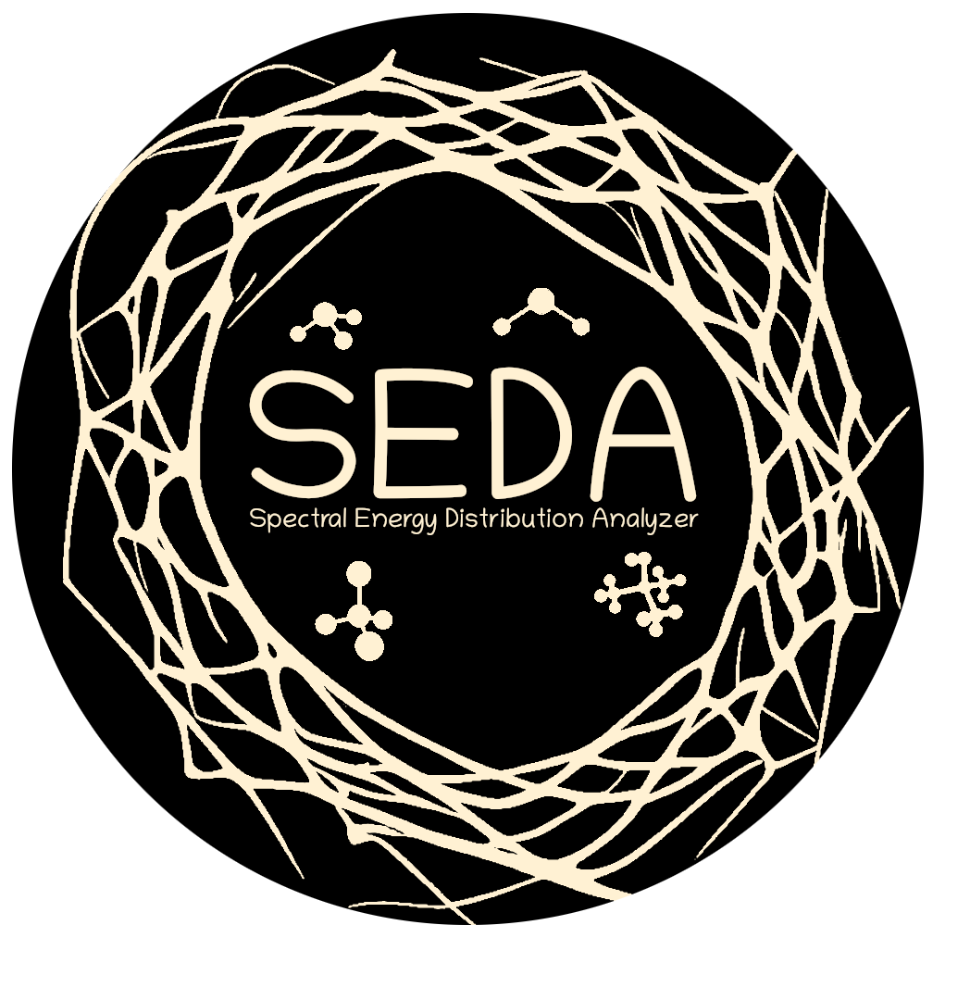

.. raw:: html

    

===================================
SEDA: Spectral Energy Distribution Analyzer
===================================

SEDA is an open-source Python package for forward modeling analysis. It compares spectra and/or photometry to modern and widely used atmospheric models for brown dwarfs, giant exoplanets, and low-mass stars. The code uses a *Bayesian* framework to sample posteriors (\texttt{bayes_fit}). Alternatively, the code minimizes chi-square to find the best model fit. 

**The SEDA release paper is**
`here <https:xxx>`__.

Check out the :doc:`usage` section for further information, including
the package :ref:`installation`.

.. note::

   This project is under active development.

.. toctree::
   :maxdepth: 2
   :caption: Contents

   Installation <user/installation>
   Github <https://github.com/suarezgenaro/seda>
   API <user/api>
