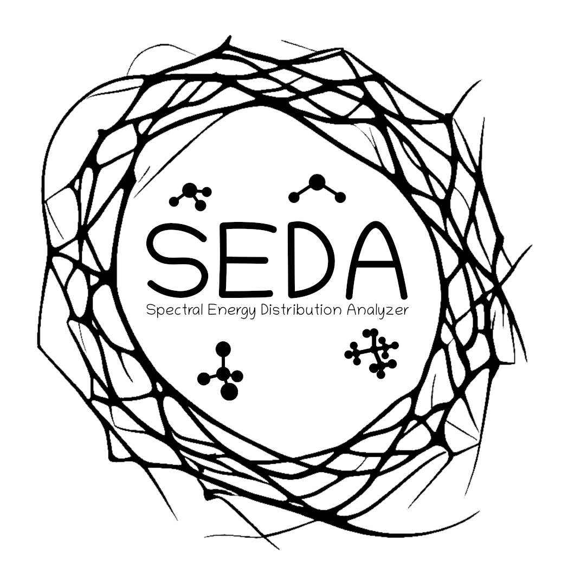

.. raw:: html

    

.. image:: SEDA_logo.png
    :width: 300px
    :align: center

===================================
Spectral Energy Distribution Analyzer (SEDA) for Forward Modeling of Ultracool Objects
===================================

SEDA is an open-source Python package for comparisons between observed data and atmospheric models. It compares spectra and/or photometry to modern and widely used atmospheric models for brown dwarfs, giant exoplanets, and low-mass stars. The code uses a *Bayesian* framework to sample posteriors. Alternatively, the code minimizes chi-square to find the best model fit. 

**The SEDA release paper is**
`here <https:xxx>`__.

Check out the :doc:`usage` section for further information, including
the package :ref:`installation`.

.. note::

   This project is under active development.

Contents
--------

.. toctree::

   usage
   api
